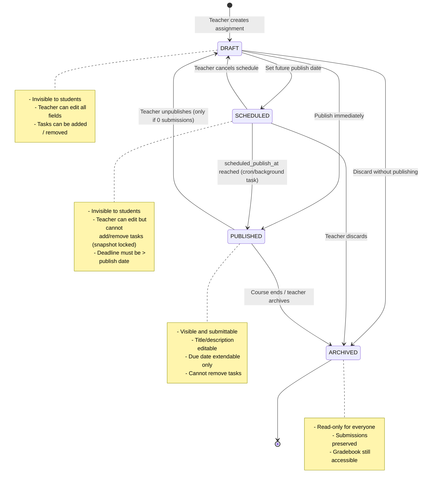
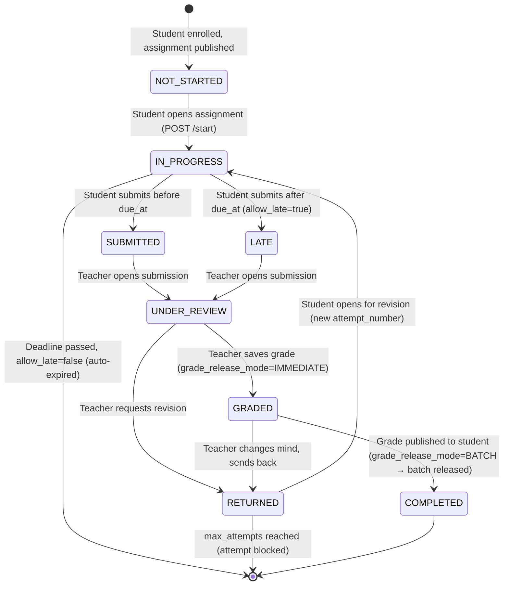

# Assignment & Grading Module — Full Architectural Redesign

> **Status:** Specification
> **Author:** Senior System Architect
> **Date:** 2026-04-28
> **Replaces:** MVP assignment/grading implementation across `apps/api/src/db/courses/assignments.py`, `db/grading/`, `routers/grading/`, and matching frontend

---

## Table of Contents

1. [Critical Analysis of Current State](#1-critical-analysis-of-current-state)
2. [Target Architecture Overview](#2-target-architecture-overview)
3. [Entity Relationship Diagram](#3-entity-relationship-diagram)
4. [State Machines](#4-state-machines)
5. [API Architecture](#5-api-architecture)
6. [Security & RBAC](#6-security--rbac)
7. [Teacher Experience (UX) Features](#7-teacher-experience-ux-features)
8. [Concurrency & Reliability](#8-concurrency--reliability)
9. [Extensibility Hooks](#9-extensibility-hooks)
10. [Testing Strategy](#10-testing-strategy)
11. [Implementation Roadmap](#11-implementation-roadmap)

---

## 1. Critical Analysis of Current State

### What Works Well (Keep)

| Component | Location | Why it's good |
|-----------|----------|--------------|
| Unified `Submission` table | `db/grading/submissions.py` | Single source of truth for all assessment types |
| Server-stamped timestamps | `submit.py` | Prevents client-side time falsification |
| `ActivityProgress` 9-state machine | `db/grading/progress.py` | Decoupled from raw submission status |
| `AssessmentPolicy` per activity | `db/grading/progress.py` | Centralizes rules, avoids scattered config |
| Chunked upload API | `routers/uploads/chunked_upload.py` | Handles large files correctly |
| Batch grade endpoint | `routers/grading/teacher.py` | Right idea, needs atomic guarantees |
| CSV streaming export | `routers/grading/teacher.py` | Correct implementation pattern |
| Per-item `GradingBreakdown` | `db/grading/submissions.py` | Foundation for inline feedback |

### Critical Gaps (Fix)

#### Gap 1 — Assignment has no lifecycle (BLOCKER)

- `Assignment` table has only a boolean `published` field.
- No `DRAFT → SCHEDULED → PUBLISHED → ARCHIVED` lifecycle.
- Teachers cannot schedule future release or archive old work.
- **Risk:** Live editing of a published assignment while students are submitting.

#### Gap 2 — Submission status machine is inconsistent (BLOCKER)

- `Submission.status` has 5 states; `ActivityProgress.state` has 9.
- They are updated in two separate write operations with no transaction guarantee.
- A crashed process mid-update leaves them permanently out of sync.
- `NEEDS_GRADING` is a "virtual" filter status, not a real DB state — this creates confusion in queries.

#### Gap 3 — Grading is not atomic (BLOCKER)

- `save_grade()` in `teacher.py` updates `Submission`, then separately updates `ActivityProgress`, then separately updates `CourseProgress`.
- If the process dies after step 1, the gradebook shows stale aggregates permanently.
- No optimistic locking; concurrent teacher edits on the same submission silently overwrite each other.

#### Gap 4 — No late-penalty enforcement (HIGH)

- `is_late` flag is stored but `late_policy_json` is never applied to `final_score`.
- The `AssessmentPolicy.allow_late` field exists but is never checked during `grade_submission()`.

#### Gap 5 — No weighted scoring (HIGH)

- `AssignmentTask.max_grade_value` exists per task, but the overall `Assignment` has no `weight` relative to the course grade.
- `CourseProgress.grade_average` is a flat average, not a weighted one.

#### Gap 6 — Draft feedback is not separated from published feedback (HIGH)

- Teachers write `feedback` directly to `GradingBreakdown`.
- Saving a partial grade immediately makes it visible via `GRADED` status.
- No concept of "I'm still reviewing this class, hide grades from students."
- **Consequence:** Students see `Graded` status mid-session and compare notes in real time.

#### Gap 7 — Resubmission loop is broken (MEDIUM)

- `RETURNED` status is meant to trigger a new student attempt.
- No endpoint creates a fresh `DRAFT` submission after `RETURNED`.
- `attempt_number` is tracked but `max_attempts` from `AssessmentPolicy` is never enforced on the submission path.

#### Gap 8 — Per-task progress is invisible to students (MEDIUM)

- Students get a single submission-level status.
- In a multi-task assignment, they cannot see which tasks are pending review.

#### Gap 9 — Minimal test coverage (HIGH)

- Only 2 grading tests exist: 1 backend contract test, 1 frontend component test.
- Zero tests for status transitions, RBAC enforcement, late detection, or concurrent writes.

#### Gap 10 — No extensibility seam for AI/plagiarism (LOW, design-time cost only)

- The grading dispatch in `grader.py` is a monolithic if/elif chain.
- Plugging in a plagiarism webhook or AI grader means editing the core file with no interface contract.

---

## 2. Target Architecture Overview

```
┌─────────────────────────────────────────────────────────────────┐
│                         CLIENT LAYER                            │
│  Next.js 16 / React 19 — TanStack Query · Zustand · shadcn/ui  │
└──────────────────────────┬──────────────────────────────────────┘
                           │ HTTPS / WebSocket (SSE for feedback)
┌──────────────────────────▼──────────────────────────────────────┐
│                        API GATEWAY                              │
│              FastAPI — JWT Auth — RBAC middleware               │
├────────────────┬──────────────┬────────────────┬────────────────┤
│  Assignment    │  Submission  │    Grading     │   Uploads      │
│  Router        │  Router      │    Router      │   Router       │
└────────┬───────┴──────┬───────┴────────┬───────┴───────┬────────┘
         │              │               │               │
┌────────▼──────────────▼───────────────▼───────────────▼────────┐
│                       SERVICE LAYER                             │
│  AssignmentService · SubmissionService · GradingService        │
│  ProgressProjector (canonical state transitions)               │
│  GraderDispatcher (pluggable grader registry)                  │
└────────┬──────────────────────────────────────────────────────┘
         │ SQLAlchemy async sessions — single DB transaction per op
┌────────▼──────────────────────────────────────────────────────┐
│                      DATABASE LAYER                            │
│  PostgreSQL — Alembic migrations — Row-level locking (FOR UPDATE SKIP LOCKED) │
└───────────────────────────────────────────────────────────────┘
         │
┌────────▼──────────────────────────────────────────────────────┐
│                    ASYNC TASK LAYER (optional)                 │
│  Background tasks (FastAPI BackgroundTask or Celery)          │
│  Plagiarism webhook · AI grader callback · Email notifications │
└───────────────────────────────────────────────────────────────┘
```

### Design Principles

- **Single-responsibility services** — `AssignmentService` owns the assignment lifecycle; `SubmissionService` owns the submission state machine; `GradingService` owns score storage. None reaches into another's table.
- **One DB transaction per state transition** — Progress, submission status, and course aggregate are all updated inside the same `async with session.begin()` block.
- **Immutable grading history** — A `GradingEntry` ledger records every score change. The current grade is the latest entry; prior entries are the audit trail.
- **Draft/Published feedback separation** — `GradingEntry` has a `published_at` timestamp. Null = draft (teacher-only). Non-null = visible to student.
- **Pluggable grader registry** — `GraderDispatcher` loads graders by assessment type from a dictionary. Adding AI grading means registering a new class, not editing existing code.

---

## 3. Entity Relationship Diagram

```mermaid
erDiagram

    %% ─── COURSE STRUCTURE ───────────────────────────────────────────
    Course {
        int     id PK
        uuid    course_uuid UK
        string  title
        int     creator_id FK
    }

    CourseEnrollment {
        int     id PK
        int     course_id FK
        int     user_id FK
        string  role "STUDENT | TEACHER | CURATOR"
        datetime enrolled_at
    }

    Activity {
        int     id PK
        uuid    activity_uuid UK
        int     course_id FK
        int     chapter_id FK
        string  activity_type "ASSIGNMENT | QUIZ | EXAM | CODE_CHALLENGE"
        int     order
        bool    is_required
    }

    %% ─── ASSIGNMENT LIFECYCLE ────────────────────────────────────────
    Assignment {
        int     id PK
        uuid    assignment_uuid UK
        int     activity_id FK
        string  title
        text    description
        string  status "DRAFT | SCHEDULED | PUBLISHED | ARCHIVED"
        datetime scheduled_publish_at "null = publish now"
        datetime due_at
        string  grading_type "NUMERIC | PERCENTAGE | PASS_FAIL"
        float   weight "0.0-1.0, default 1.0 (unweighted)"
        int     created_by FK
        datetime created_at
        datetime updated_at
        datetime published_at
        datetime archived_at
    }

    AssignmentTask {
        int     id PK
        uuid    task_uuid UK
        int     assignment_id FK
        string  type "FILE | QUIZ | FORM | OTHER"
        string  title
        text    description
        text    hint
        int     order
        float   max_grade_value "0-100"
        float   weight "relative weight within assignment"
        json    contents "typed per task type"
        string  reference_file_key "S3/storage key"
        bool    is_required "for partial-submit support"
        datetime created_at
        datetime updated_at
    }

    AssessmentPolicy {
        int     id PK
        uuid    policy_uuid UK
        int     activity_id FK
        string  grading_mode "AUTO | MANUAL | AUTO_THEN_MANUAL"
        string  completion_rule "SUBMITTED | GRADED | PASSED | TEACHER_VERIFIED"
        float   passing_score "default 60.0"
        int     max_attempts "null = unlimited"
        int     time_limit_seconds
        bool    allow_late
        json    late_policy "LatePolicy schema"
        int     max_late_days "null = unlimited"
        bool    grade_release_mode "IMMEDIATE | BATCH"
        datetime batch_release_at "null unless BATCH mode"
    }

    %% ─── SUBMISSION STATE MACHINE ────────────────────────────────────
    Submission {
        int     id PK
        uuid    submission_uuid UK
        int     activity_id FK
        int     user_id FK
        string  assessment_type "ASSIGNMENT | QUIZ | EXAM | CODE_CHALLENGE"
        string  status "DRAFT | SUBMITTED | LATE | UNDER_REVIEW | RETURNED | GRADED"
        int     attempt_number "1-based"
        bool    is_late
        float   late_penalty_pct "applied penalty (0-100)"
        json    answers_json
        int     grading_version
        datetime started_at
        datetime submitted_at
        datetime graded_at
        datetime created_at
        datetime updated_at
        int     xmin "Postgres transaction ID for optimistic locking"
    }

    SubmissionFile {
        int     id PK
        int     submission_id FK
        int     task_id FK
        string  file_key "storage key"
        string  original_filename
        string  mime_type
        int     file_size_bytes
        string  virus_scan_status "PENDING | CLEAN | FLAGGED"
        datetime uploaded_at
    }

    %% ─── GRADING LEDGER (immutable history) ──────────────────────────
    GradingEntry {
        int     id PK
        uuid    entry_uuid UK
        int     submission_id FK
        int     graded_by FK "user_id of teacher"
        float   raw_score "0-100 before penalty"
        float   penalty_pct "snapshot of late_penalty at time of grading"
        float   final_score "raw_score * (1 - penalty_pct/100)"
        json    breakdown "GradingBreakdown: per-task scores + feedback"
        text    overall_feedback "teacher's overall comment (draft until published)"
        datetime created_at "immutable — never updated"
        datetime published_at "null = draft, non-null = visible to student"
    }

    ItemFeedback {
        int     id PK
        int     grading_entry_id FK
        int     task_id FK "AssignmentTask or quiz question id"
        string  item_ref "opaque ref to sub-item (e.g. question_uuid)"
        text    comment
        float   score
        float   max_score
        string  annotation_type "TEXT | HIGHLIGHT | AUDIO"
        string  annotation_data_key "storage key for audio/file annotation"
        int     graded_by FK
        datetime created_at
        datetime updated_at
    }

    %% ─── PROGRESS PROJECTION ─────────────────────────────────────────
    ActivityProgress {
        int     id PK
        int     activity_id FK
        int     user_id FK
        int     course_id FK
        string  state "NOT_STARTED | IN_PROGRESS | SUBMITTED | LATE | UNDER_REVIEW | RETURNED | GRADED | PASSED | FAILED | COMPLETED"
        float   score "latest published final_score"
        bool    passed
        bool    is_late
        int     attempt_count
        int     best_submission_id FK
        int     latest_submission_id FK
        bool    grade_visible "mirrors AssessmentPolicy.grade_release_mode"
        datetime completed_at
        datetime updated_at
    }

    CourseProgress {
        int     id PK
        int     course_id FK
        int     user_id FK
        int     completed_required_count
        int     total_required_count
        float   progress_pct
        float   weighted_grade_average "respects Assignment.weight"
        bool    certificate_eligible
        int     needs_grading_count "teacher-facing aggregate"
        datetime updated_at
    }

    %% ─── BULK ACTION AUDIT ───────────────────────────────────────────
    BulkAction {
        int     id PK
        uuid    action_uuid UK
        int     performed_by FK
        string  action_type "EXTEND_DEADLINE | RELEASE_GRADES | RETURN_ALL | OVERRIDE_SCORE"
        json    params "typed per action_type"
        json    target_user_ids
        int     activity_id FK
        string  status "PENDING | RUNNING | COMPLETED | FAILED"
        int     affected_count
        text    error_log
        datetime created_at
        datetime completed_at
    }

    %% ─── RELATIONSHIPS ───────────────────────────────────────────────
    Course             ||--o{ CourseEnrollment    : "has"
    Course             ||--o{ Activity            : "contains"
    Activity           ||--o| Assignment          : "is-a"
    Activity           ||--o| AssessmentPolicy    : "governed-by"
    Assignment         ||--o{ AssignmentTask      : "has"
    Activity           ||--o{ Submission          : "receives"
    Submission         ||--o{ SubmissionFile      : "contains"
    Submission         ||--o{ GradingEntry        : "graded-by"
    GradingEntry       ||--o{ ItemFeedback        : "details"
    Activity           ||--o{ ActivityProgress    : "tracked-in"
    Course             ||--o{ CourseProgress      : "tracked-in"
    Activity           ||--o{ BulkAction          : "target-of"
```



---

## 4. State Machines

### 4.1 Assignment Lifecycle



**Invariant:** A `PUBLISHED` assignment cannot revert to `DRAFT` once any submission exists. This prevents the "moving goalposts" problem where a teacher edits task criteria mid-submission window.

### 4.2 Submission State Machine



**Key rules enforced by `SubmissionService`:**

| Transition | Pre-condition | Side-effect |
|------------|--------------|-------------|
| `NOT_STARTED → IN_PROGRESS` | Enrollment confirmed; assignment `PUBLISHED`; `attempt_count < max_attempts` | Creates `Submission(status=DRAFT)`, stamps `started_at` |
| `IN_PROGRESS → SUBMITTED` | All `is_required` tasks answered | Stamps `submitted_at`; evaluates `is_late`; applies `late_penalty_pct`; triggers auto-grader if `grading_mode=AUTO` |
| `IN_PROGRESS → LATE` | Same as above, but `submitted_at > due_at` | Same + sets `is_late=True`, calculates `late_penalty_pct` from `LatePolicy` |
| `UNDER_REVIEW → GRADED` | `final_score` provided; teacher has `grading:write` on course | Writes `GradingEntry`; updates `ActivityProgress`; if `grade_release_mode=IMMEDIATE` sets `published_at` |
| `GRADED → COMPLETED` | `published_at` set on latest `GradingEntry` | Updates `ActivityProgress.grade_visible=True`; re-computes `CourseProgress` |
| `RETURNED → IN_PROGRESS` | `attempt_count < max_attempts` | Increments `attempt_count`, creates new `DRAFT` submission |

### 4.3 Late Penalty Calculation

`late_policy_json` conforms to this schema:

```typescript
type LatePolicy =
  | { type: "NO_PENALTY" }
  | { type: "FLAT_PERCENT"; percent: number }               // e.g. 10% deducted
  | { type: "PER_DAY"; percent_per_day: number; max_pct: number }  // 5%/day, cap 50%
  | { type: "ZERO_GRADE" }                                  // any late = 0
```

`late_penalty_pct` is computed at submission time (server-side, immutable after submission). `final_score = raw_score * (1 - late_penalty_pct / 100)`.

---

## 5. API Architecture

### 5.1 Assignment Management

```
# Assignment Lifecycle
POST   /api/v1/courses/{course_uuid}/assignments
       Body: AssignmentCreate { title, description, due_at, grading_type, weight,
                                scheduled_publish_at?, tasks?: AssignmentTaskCreate[] }
       → 201 AssignmentRead

GET    /api/v1/courses/{course_uuid}/assignments/{assignment_uuid}
       → AssignmentRead (includes tasks, policy snapshot)

PATCH  /api/v1/courses/{course_uuid}/assignments/{assignment_uuid}
       Body: AssignmentPatch (only fields allowed for current status)
       → 200 AssignmentRead
       → 409 if invalid lifecycle transition

POST   /api/v1/courses/{course_uuid}/assignments/{assignment_uuid}/publish
       Body: { scheduled_at?: datetime }   # omit for immediate
       → 200 AssignmentRead { status: "PUBLISHED" | "SCHEDULED" }

POST   /api/v1/courses/{course_uuid}/assignments/{assignment_uuid}/archive
       → 200 AssignmentRead { status: "ARCHIVED" }

# Task Management (locked after PUBLISHED)
POST   /api/v1/courses/{course_uuid}/assignments/{assignment_uuid}/tasks
PUT    /api/v1/courses/{course_uuid}/assignments/{assignment_uuid}/tasks/{task_uuid}
DELETE /api/v1/courses/{course_uuid}/assignments/{assignment_uuid}/tasks/{task_uuid}
POST   /api/v1/courses/{course_uuid}/assignments/{assignment_uuid}/tasks/reorder
       Body: { order: [task_uuid, task_uuid, ...] }
```

### 5.2 Submission Endpoints (Student)

```
# Start attempt
POST   /api/v1/submissions/start
       Body: { activity_uuid: str, assessment_type: str }
       → 201 SubmissionRead { status: "DRAFT", attempt_number: N }
       → 409 if max_attempts reached
       → 403 if assignment not PUBLISHED

# Auto-save draft (idempotent)
PATCH  /api/v1/submissions/{submission_uuid}/draft
       Body: AnswersPayload (partial answers)
       → 200 SubmissionRead

# Final submit
POST   /api/v1/submissions/{submission_uuid}/submit
       Body: AnswersPayload (must satisfy all is_required tasks)
       → 200 SubmissionRead { status: "SUBMITTED" | "LATE" }
       → 422 if required tasks missing

# Upload file for a file-type task
POST   /api/v1/submissions/{submission_uuid}/tasks/{task_uuid}/upload
       multipart/form-data: file
       Headers: Content-Range (for resumable uploads)
       → 202 { file_uuid, bytes_received, complete: bool }

# Student's own submissions
GET    /api/v1/submissions/me?activity_uuid={uuid}
       → list[SubmissionRead]  (latest first, published grades only)
```

### 5.3 Teacher Grading Endpoints

```
# Submissions list with filters
GET    /api/v1/grading/submissions
       Query: activity_uuid, status[], late_only, search, sort_by, sort_dir, page, page_size
       → PaginatedSubmissionList { items, total, needs_grading_count, late_count }

# Stats header
GET    /api/v1/grading/submissions/stats?activity_uuid={uuid}
       → SubmissionStats { total, submitted, graded, published, returned,
                           avg_score, pass_rate, late_count, not_started_count }

# Single submission with full grading detail
GET    /api/v1/grading/submissions/{submission_uuid}
       → SubmissionDetail { submission, answers, files[], latest_grading_entry,
                            grading_history[], student_profile }

# Grade a submission (atomic — updates Submission + GradingEntry + ActivityProgress)
POST   /api/v1/grading/submissions/{submission_uuid}/grade
       Body: GradeInput {
           raw_score: float,
           item_feedback: ItemFeedbackInput[],
           overall_feedback: str,
           publish: bool   # true = set published_at immediately
       }
       → 200 GradingEntry
       → 409 if submission not in gradable state
       Optimistic lock: If-Match: "{xmin}" header required
       → 412 Precondition Failed if xmin stale (concurrent edit)

# Batch grade (atomic per-item, non-transactional across items)
POST   /api/v1/grading/submissions/batch-grade
       Body: { grades: GradeInput[], publish: bool }  (max 100)
       → BatchGradeResult { succeeded: [], failed: [{ uuid, reason }] }

# Publish grades (release to students)
POST   /api/v1/grading/activities/{activity_uuid}/publish-grades
       Body: { submission_uuids?: [uuid] }  # omit = publish ALL graded
       → 200 { published_count: int }

# Bulk deadline extension
POST   /api/v1/grading/activities/{activity_uuid}/extend-deadline
       Body: { user_uuids: [uuid], new_due_at: datetime, reason?: str }
       → 202 BulkAction { action_uuid, status: "RUNNING" }

GET    /api/v1/grading/bulk-actions/{action_uuid}
       → BulkAction (polling for async completion)

# Inline feedback CRUD
GET    /api/v1/grading/grading-entries/{entry_uuid}/feedback
POST   /api/v1/grading/grading-entries/{entry_uuid}/feedback
       Body: ItemFeedbackInput { task_uuid, item_ref?, comment, score?, annotation_type?, file }
PATCH  /api/v1/grading/item-feedback/{feedback_id}
DELETE /api/v1/grading/item-feedback/{feedback_id}

# CSV export (streaming)
GET    /api/v1/grading/submissions/export?activity_uuid={uuid}&format=csv
       Response: text/csv (streamed)

# Gradebook matrix
GET    /api/v1/grading/courses/{course_uuid}/gradebook
       Query: chapter_uuid?, search?, state[]
       → CourseGradebookResponse
```

### 5.4 Real-Time Feedback (SSE)

Rather than WebSockets (heavier), use **Server-Sent Events** for the feedback loop:

```
GET    /api/v1/grading/submissions/{submission_uuid}/feedback-stream
       Accept: text/event-stream
       → SSE stream of FeedbackEvent { type, payload }
```

Event types:

| Event | Direction | Trigger |
|-------|-----------|---------|
| `feedback.item.created` | Teacher → Student | Teacher posts `ItemFeedback` |
| `feedback.item.updated` | Teacher → Student | Teacher edits feedback |
| `grade.published` | Teacher → Student | `published_at` set |
| `submission.returned` | Teacher → Student | Status → RETURNED |

Students connect to this stream while viewing their submission result page. Teachers connect while grading to see if a student is viewing in real time (presence indicator).

Implementation: FastAPI `StreamingResponse` backed by Redis pub/sub channel per `submission_uuid`. No external message broker needed for MVP — use Redis that already exists for sessions.

### 5.5 Large File Uploads

The existing chunked upload API (`/api/v1/uploads/`) is structurally correct. The following additions are needed:

1. **Tie upload session to submission** — `initiate` must accept `submission_uuid` + `task_uuid` and validate submission is in `DRAFT` state.
2. **Resumable uploads** — Store chunk manifest in Redis; on re-connect client sends `GET /api/v1/uploads/status/{upload_id}` to get `next_expected_chunk`.
3. **Virus scan hook** — On `complete`, enqueue background task: `virus_scan(file_key)`. Set `SubmissionFile.virus_scan_status = PENDING` immediately; update to `CLEAN` or `FLAGGED` async. Block submission finalization if any file is `FLAGGED` or `PENDING`.
4. **Size / MIME validation** — Enforce `AssignmentFileTaskConfig.allowed_mime_types` and `max_file_size_mb` at `initiate` time, not just at `complete`, to fail fast.

---

## 6. Security & RBAC

### 6.1 Permission Matrix

| Permission | Student | Teacher (enrolled) | Curator | Admin |
|------------|---------|-------------------|---------|-------|
| `assignment:read:own-course` | ✓ (published only) | ✓ | ✓ | ✓ |
| `assignment:create:course` | ✗ | ✓ | ✓ | ✓ |
| `assignment:update:course` | ✗ | ✓ (own) | ✓ | ✓ |
| `assignment:publish:course` | ✗ | ✓ | ✓ | ✓ |
| `assignment:archive:course` | ✗ | ✓ | ✓ | ✓ |
| `submission:create:own` | ✓ | ✗ | ✗ | ✗ |
| `submission:read:own` | ✓ | ✗ | ✗ | ✓ |
| `submission:read:course` | ✗ | ✓ | ✓ | ✓ |
| `grading:write:course` | ✗ | ✓ | ✓ | ✓ |
| `grading:publish:course` | ✗ | ✓ | ✓ | ✓ |
| `grading:export:course` | ✗ | ✓ | ✓ | ✓ |
| `grade:read:own` | ✓ (published only) | ✗ | ✗ | ✓ |

### 6.2 Critical Isolation Rules

**Students cannot see each other's grades:**

- `GET /api/v1/submissions/me` is scoped to `user_id = current_user.id` at the ORM level (not just a WHERE clause that could be bypassed).
- The `GradingEntry` table is never exposed via student-facing endpoints. Students receive a projected view: `{ score: float | null, feedback: str | null }` extracted only from entries where `published_at IS NOT NULL`.
- The gradebook endpoint (`/gradebook`) is gated by `grading:read:course` which students do not have.

**Teachers cannot grade outside their enrolled courses:**

- `PermissionChecker.require()` resolves `grading:write:course` by checking `CourseEnrollment(user_id=teacher, course_id=..., role IN ["TEACHER", "CURATOR"])`.
- No global `grading:write:*` permission exists in the system.

**Optimistic locking prevents silent concurrent overwrites:**

- Every `PATCH /grading/submissions/{uuid}/grade` requires `If-Match: "{xmin}"` header.
- PostgreSQL's system column `xmin` (transaction ID) changes on every row update.
- If two teachers open the same submission, the second `PATCH` returns `412 Precondition Failed` with a message indicating a newer grade exists.

**Draft feedback is never leaked:**

- The student-facing submission endpoint fetches `GradingEntry WHERE published_at IS NOT NULL ORDER BY created_at DESC LIMIT 1`.
- The teacher endpoint fetches `GradingEntry ORDER BY created_at DESC LIMIT 1` regardless of `published_at`.

### 6.3 Input Validation Boundaries

| Boundary | Validation |
|----------|-----------|
| Answer payload size | Max 1 MB JSON body for quiz/form answers |
| File upload | MIME type allowlist + `max_file_size_mb` from `AssignmentFileTaskConfig` |
| Score range | `0 ≤ raw_score ≤ max_grade_value` enforced in Pydantic validator |
| Deadline extension | `new_due_at > NOW()` enforced server-side; client cannot set backdated extensions |
| Attempt number | Server-assigned; client never sends `attempt_number` |
| `submitted_at` | Server-stamped; never accepted from client |

---

## 7. Teacher Experience (UX) Features

### 7.1 The Grading Dashboard — Bird's Eye View

The `GET /gradebook` endpoint returns a `GradebookSummary` with real-time counts:

```
┌────────────────────────────────────────────────────────────┐
│  Assignment 3: Data Structures Quiz          Week 4        │
├──────────┬──────────┬──────────┬──────────┬───────────────┤
│ Total    │ Submitted│ Graded   │ Not Graded│ Not Started   │
│  30      │  22      │  10      │  12       │  8            │
├──────────┴──────────┴──────────┴──────────┴───────────────┤
│ Avg Score: 74.2%   Pass Rate: 68%   Late: 3   Overdue: 2  │
└────────────────────────────────────────────────────────────┘
```

The `TeacherAction` work queue in the gradebook response is sorted by:

1. `is_late = true` (urgent — student waited longer)
2. `submitted_at ASC` (FIFO fairness)
3. `student_name ASC` (tie-break)

### 7.2 Inline Feedback

`ItemFeedback` records link to a specific `task_uuid` and optionally an `item_ref` (e.g., a paragraph UUID in a rich-text submission or a question UUID in a form). The frontend renders feedback annotations inline alongside the relevant content.

**Draft vs Published feedback flow:**

1. Teacher opens submission → `GradingEntry` is created in **draft** state (`published_at = null`).
2. Teacher adds `ItemFeedback` records. None are visible to the student.
3. Teacher clicks "Save Grade" → `GradingEntry.raw_score` is set, status → `GRADED`. Still not published.
4. Teacher clicks "Publish to Student" (or batch-releases all) → `published_at = NOW()`, `ActivityProgress.grade_visible = true`. SSE event fires to student.
5. Student refreshes / SSE triggers → sees grade + feedback.

This matches the **"grade the whole class, then release"** pattern requested.

### 7.3 Bulk Actions

All bulk actions are **async** (returns `202 + BulkAction` with polling URL) to avoid HTTP timeouts on large classes.

**Extend deadline for specific students:**

```json
POST /api/v1/grading/activities/{activity_uuid}/extend-deadline
{
  "user_uuids": ["uuid-1", "uuid-2"],
  "new_due_at": "2026-05-10T23:59:00Z",
  "reason": "Medical accommodation"
}
```

Side-effects: updates `AssessmentPolicy` per-student extension record (new table `StudentPolicyOverride`), recalculates `is_late` for any existing submissions, emits notification to affected students.

**Release all grades simultaneously:**

```json
POST /api/v1/grading/activities/{activity_uuid}/publish-grades
{
  "submission_uuids": null   // null = all graded submissions
}
```

Side-effects: bulk-sets `GradingEntry.published_at`, updates `ActivityProgress.grade_visible`, emits SSE to all affected students, updates `CourseProgress`.

---

## 8. Concurrency & Reliability

### 8.1 Atomic State Transitions

Every state transition function follows this pattern:

```python
async def submit_assignment(
    db: AsyncSession,
    submission_uuid: str,
    answers: AnswersPayload,
) -> Submission:
    async with db.begin():  # single transaction — all or nothing
        submission = await db.execute(
            select(Submission)
            .where(Submission.submission_uuid == submission_uuid)
            .with_for_update()   # row-level lock prevents concurrent double-submit
        )

        _validate_transition(submission.status, SubmissionStatus.SUBMITTED)

        submission.status = SubmissionStatus.SUBMITTED
        submission.submitted_at = utcnow()
        submission.is_late = submission.submitted_at > policy.due_at
        submission.late_penalty_pct = _calculate_penalty(submission, policy)

        # Auto-grade if applicable
        grading_result = await grader_dispatcher.grade(submission, answers)
        if grading_result:
            entry = GradingEntry(
                submission_id=submission.id,
                raw_score=grading_result.score,
                final_score=grading_result.score * (1 - submission.late_penalty_pct / 100),
                breakdown=grading_result.breakdown,
                # published_at = None (draft) for MANUAL, NOW() for AUTO
                published_at=utcnow() if policy.grading_mode == "AUTO" else None,
            )
            db.add(entry)

        # Update progress projection in SAME transaction
        await _update_activity_progress(db, submission)
        await _update_course_progress(db, submission.user_id, submission.activity.course_id)

    return submission
```

Key invariants:

- **`SELECT FOR UPDATE`** prevents the double-submit race where a student clicks Submit twice.
- All three tables (`Submission`, `ActivityProgress`, `CourseProgress`) are updated in one transaction. If anything fails, all roll back.
- `GradingEntry` is **append-only** (never UPDATE, only INSERT). Historical grades are preserved.

### 8.2 Handling Hundreds of Concurrent Submissions

When 200 students submit simultaneously (e.g., at a deadline):

- Each submission acquires a lock only on **its own row** (`SELECT FOR UPDATE` on `submission_uuid`). There is no table-level contention.
- `CourseProgress` is a potential bottleneck (all 200 updates target the same `(course_id, user_id)` rows). Mitigated by:
  - `SELECT FOR UPDATE SKIP LOCKED` on `CourseProgress` — failed lock attempts are retried asynchronously by a background task.
  - Alternatively, defer `CourseProgress` updates to a background task triggered by a lightweight job queue (Redis list), updated every 30 seconds by a worker.
- `ActivityProgress` rows are per-student, so 200 concurrent submissions result in 200 different rows — no contention.
- File uploads go through the chunked upload service which is stateless and scales horizontally.

### 8.3 Idempotency

Both student-submit and teacher-grade are idempotent:

- Student re-submitting an already-`SUBMITTED` submission returns the existing submission (no duplicate `GradingEntry`).
- Teacher sending the same grade twice creates a new `GradingEntry` only if `raw_score` or `breakdown` differs. If identical, returns the existing entry (`304 Not Modified` hint in response).

---

## 9. Extensibility Hooks

### 9.1 Pluggable Grader Registry

Replace the current `if/elif` chain in `grader.py` with a registry:

```python
# services/grading/registry.py

class GraderRegistry:
    _graders: dict[AssessmentType, type[BaseGrader]] = {}

    @classmethod
    def register(cls, assessment_type: AssessmentType):
        def decorator(grader_cls: type[BaseGrader]):
            cls._graders[assessment_type] = grader_cls
            return grader_cls
        return decorator

    @classmethod
    def get(cls, assessment_type: AssessmentType) -> BaseGrader:
        return cls._graders[assessment_type]()

# Usage:
@GraderRegistry.register(AssessmentType.QUIZ)
class QuizGrader(BaseGrader): ...

@GraderRegistry.register(AssessmentType.ASSIGNMENT)
class ManualAssignmentGrader(BaseGrader): ...

# Plugging in AI grader later — NO existing file needs to change:
@GraderRegistry.register(AssessmentType.AI_ESSAY)
class AIEssayGrader(BaseGrader):
    async def grade(self, submission, answers) -> GradingResult:
        result = await ai_client.grade_essay(answers.text)
        return GradingResult(score=result.score, breakdown=result.breakdown)
```

### 9.2 Plagiarism Check Hook

`SubmissionService` fires a post-submit hook event:

```python
# After submission is committed:
await event_bus.emit(SubmissionSubmittedEvent(
    submission_uuid=submission.submission_uuid,
    assessment_type=submission.assessment_type,
    file_keys=[f.file_key for f in submission.files],
))
```

A `PlagiarismCheckSubscriber` subscribes to `SubmissionSubmittedEvent`:

- Calls external plagiarism API (e.g., Turnitin, Copyleaks) asynchronously.
- Stores result in a `PlagiarismReport` table (separate concern — no coupling to `Submission`).
- Sets `ActivityProgress.teacher_action_required = True` if similarity > threshold.
- Appears as a `PLAGIARISM_REVIEW` `TeacherAction` in the gradebook.

This follows the **Open/Closed Principle**: the submission workflow is closed for modification but open for extension via events.

### 9.3 Grading Rubric Support (Future)

The `GradingEntry.breakdown` JSON is versioned via `grading_version`. When rubric support is added:

- Add a `Rubric` table linked to `Assignment`.
- Bump `grading_version` to 2.
- The grader writes rubric criteria scores into `breakdown`.
- Old entries (version 1) are still readable with the old schema — no migration needed.

---

## 10. Testing Strategy

### 10.1 Test Pyramid

```
                   ┌───────┐
                   │  E2E  │  (2-3 critical paths: submit → grade → view)
                  ┌┴───────┴┐
                  │  Integ  │  (API + DB: state transitions, RBAC, concurrency)
                 ┌┴─────────┴┐
                 │   Unit    │  (Graders, state machine validators, penalty calc)
                └───────────┘
```

### 10.2 Unit Tests (Fast, no DB)

```
tests/unit/
  grading/
    test_late_penalty.py           # All 4 LatePolicy types × boundary dates
    test_submission_state_machine.py  # All valid + invalid transitions
    test_assignment_lifecycle.py   # DRAFT→PUBLISHED→ARCHIVED invariants
    test_grade_calculation.py      # Weighted scoring, penalty application
  graders/
    test_quiz_grader.py
    test_exam_grader.py
    test_code_grader.py
```

### 10.3 Integration Tests (FastAPI TestClient + test DB)

```
tests/integration/
  test_submit_workflow.py
    - test_student_can_submit_before_deadline
    - test_submission_marked_late_after_deadline
    - test_double_submit_is_idempotent
    - test_student_cannot_submit_to_archived_assignment
    - test_max_attempts_enforced

  test_grading_workflow.py
    - test_teacher_can_grade_submitted_submission
    - test_grade_saves_atomically (kill process mid-grade → check consistency)
    - test_draft_grade_not_visible_to_student
    - test_published_grade_visible_to_student
    - test_concurrent_grade_returns_412

  test_rbac_enforcement.py
    - test_student_cannot_read_another_student_submission
    - test_student_cannot_access_gradebook
    - test_teacher_outside_course_cannot_grade
    - test_admin_can_read_any_submission

  test_bulk_actions.py
    - test_deadline_extension_recalculates_is_late
    - test_bulk_release_fires_sse_events
    - test_bulk_grade_up_to_100

  test_file_upload.py
    - test_chunked_upload_completes
    - test_resume_after_interruption
    - test_invalid_mime_type_rejected_at_initiate
```

### 10.4 Contract Tests

The existing `test_grading_gradebook_contract.py` pattern is correct. Extend it:

```
tests/contracts/
  test_submission_api_contract.py    # Response shape for all submission endpoints
  test_grading_api_contract.py       # Response shape for grading endpoints
  test_assignment_api_contract.py    # Response shape for assignment endpoints
```

### 10.5 Frontend Tests

```
tests/
  grading/
    course-gradebook.test.tsx          # (exists — expand)
    submission-status-badge.test.tsx   # All 9 states render correctly
    grading-panel.test.tsx             # Draft vs published feedback visibility
    batch-grading-panel.test.tsx       # 100-item limit, error handling
  assignments/
    assignment-lifecycle.test.tsx      # Publish/Archive button state per status
    task-editor.test.tsx               # Locked after PUBLISHED
```

---

## 11. Implementation Roadmap

### Phase 0 — Foundation (Week 1-2)

**Goal:** Fix the three blockers before any new feature lands.

| # | Task | Files |
|---|------|-------|
| 0.1 | Add `status` column to `Assignment` with 4-state enum; migrate `published: bool` → `status: PUBLISHED\|DRAFT` | `db/courses/assignments.py`, Alembic migration |
| 0.2 | Add `GradingEntry` table (ledger); deprecate inline `GradingBreakdown` on `Submission`; write migration | New: `db/grading/entries.py` |
| 0.3 | Wrap `save_grade()` + `ActivityProgress` update + `CourseProgress` update in single transaction | `services/grading/teacher.py` |
| 0.4 | Add `xmin`-based optimistic lock to `PATCH /grade` endpoint | `routers/grading/teacher.py` |
| 0.5 | Add `late_penalty_pct` computation on submit | `services/grading/submit.py` |

**Exit criteria:** All existing tests pass; new tests `test_grading_workflow.py` pass for atomic grading and concurrent edit detection.

---

### Phase 1 — Assignment Lifecycle (Week 3)

| # | Task | Files |
|---|------|-------|
| 1.1 | Implement `AssignmentLifecycleService` with state guard methods | New: `services/courses/assignment_lifecycle.py` |
| 1.2 | Add `POST /assignments/{uuid}/publish` and `POST /assignments/{uuid}/archive` endpoints | `routers/courses/assignments.py` |
| 1.3 | Lock task edits when `status = PUBLISHED` | `routers/courses/assignments.py` |
| 1.4 | Background task: scan for `SCHEDULED` assignments past `scheduled_publish_at` and auto-publish | New: `tasks/assignment_scheduler.py` |
| 1.5 | Frontend: Assignment status badge + publish/archive buttons | `apps/web/components/Assignments/AssignmentHeader.tsx` |

---

### Phase 2 — Submission State Machine & Resubmission (Week 4)

| # | Task | Files |
|---|------|-------|
| 2.1 | Refactor `SubmissionService` with explicit state transition table and guard checks | `services/grading/submission.py` |
| 2.2 | Implement `POST /submissions/{uuid}/submit` replacing legacy endpoint | `routers/grading/submit.py` |
| 2.3 | Implement resubmission: `RETURNED → IN_PROGRESS` creates new `DRAFT` | `services/grading/submission.py` |
| 2.4 | Enforce `max_attempts` on `POST /start` | `routers/grading/submit.py` |
| 2.5 | Add `StudentPolicyOverride` table for per-student deadline extensions | New: `db/grading/overrides.py` |
| 2.6 | Test all state transitions | `tests/integration/test_submit_workflow.py` |

---

### Phase 3 — Draft/Published Feedback Separation (Week 5)

| # | Task | Files |
|---|------|-------|
| 3.1 | Add `grade_release_mode` to `AssessmentPolicy`; add `published_at` to `GradingEntry` | `db/grading/progress.py`, `db/grading/entries.py` |
| 3.2 | Update student submission endpoint to filter `GradingEntry WHERE published_at IS NOT NULL` | `routers/grading/submit.py` |
| 3.3 | Add `POST /activities/{uuid}/publish-grades` bulk release endpoint | `routers/grading/teacher.py` |
| 3.4 | Frontend: "Save Draft Grade" vs "Publish Grade" button distinction in `GradingPanel` | `apps/web/components/Grading/GradingPanel.tsx` |
| 3.5 | Frontend: Show "Awaiting Publication" state in `SubmissionStatusBadge` | `apps/web/components/Grading/SubmissionStatusBadge.tsx` |

---

### Phase 4 — Weighted Scoring & Late Penalties (Week 6)

| # | Task | Files |
|---|------|-------|
| 4.1 | Add `weight` to `Assignment`; update `CourseProgress.weighted_grade_average` calculation | `db/courses/assignments.py`, `services/grading/progress.py` |
| 4.2 | Implement all 4 `LatePolicy` types in `_calculate_penalty()` | `services/grading/submit.py` |
| 4.3 | Expose late penalty in `SubmissionRead` response (show student why score was reduced) | `db/grading/schemas.py` |
| 4.4 | Test all penalty types and edge cases (submitted exactly on due_at, 1 second late, etc.) | `tests/unit/grading/test_late_penalty.py` |

---

### Phase 5 — Inline Feedback & SSE (Week 7-8)

| # | Task | Files |
|---|------|-------|
| 5.1 | Add `ItemFeedback` table; CRUD endpoints | New: `db/grading/item_feedback.py`, `routers/grading/feedback.py` |
| 5.2 | SSE endpoint `/submissions/{uuid}/feedback-stream` backed by Redis pub/sub | New: `routers/grading/sse.py` |
| 5.3 | Emit SSE events on `GradingEntry.published_at` set, `RETURNED` transition | `services/grading/teacher.py` |
| 5.4 | Frontend: Inline comment component in `GradingPanel` | `apps/web/components/Grading/InlineFeedback.tsx` |
| 5.5 | Frontend: Toast notification / auto-refresh when `grade.published` SSE received | `apps/web/components/Student/SubmissionResult.tsx` |

---

### Phase 6 — Bulk Actions & Teacher Dashboard Polish (Week 9)

| # | Task | Files |
|---|------|-------|
| 6.1 | Implement `BulkAction` table + async execution pattern | New: `db/grading/bulk_actions.py`, `services/grading/bulk.py` |
| 6.2 | Deadline extension endpoint + per-student policy override | `routers/grading/teacher.py` |
| 6.3 | Batch grade endpoint with atomicity-per-item guarantee | `routers/grading/teacher.py` |
| 6.4 | Frontend: Bulk select + "Extend deadline" modal in `CourseGradebook` | `apps/web/components/Grading/CourseGradebook.tsx` |
| 6.5 | Frontend: "Release All Grades" one-click button with confirmation dialog | `apps/web/components/Grading/GradebookToolbar.tsx` |

---

### Phase 7 — Extensibility & Testing Hardening (Week 10)

| # | Task | Files |
|---|------|-------|
| 7.1 | Refactor `grader.py` to `GraderRegistry` pattern | `services/grading/registry.py` |
| 7.2 | Add `event_bus.emit(SubmissionSubmittedEvent)` hook | `services/grading/submission.py` |
| 7.3 | Stub `PlagiarismCheckSubscriber` (logs only, ready for real integration) | New: `services/integrations/plagiarism.py` |
| 7.4 | Fill test coverage to ≥80% on all grading service files | `tests/` |
| 7.5 | Add RBAC enforcement tests | `tests/integration/test_rbac_enforcement.py` |
| 7.6 | Performance test: simulate 200 concurrent submissions, verify no deadlocks | `tests/load/test_concurrent_submissions.py` |

---

## Appendix A — Database Migration Strategy

1. Each phase generates one Alembic migration file.
2. Migrations are **additive** in Phases 0-6 (new columns nullable or with defaults; no column drops).
3. Column drops for deprecated fields (`Submission.grading_json`, `published: bool`) happen in Phase 7 after verifying all reads use the new schema.
4. Zero-downtime strategy: deploy code reading from both old and new columns → run migration → deploy code reading only from new columns → remove old column.

## Appendix B — Open Questions for Product

1. **Plagiarism threshold**: What similarity percentage triggers `PLAGIARISM_REVIEW` teacher action?
2. **Grade appeal workflow**: Should students be able to formally dispute a grade, or is `RETURNED` sufficient?
3. **Audio feedback**: Is audio annotation a P0 feature or can it wait post-launch?
4. **Grade curves**: Is there a requirement for curve/adjustment operations (e.g., add 5 points to all scores)?
5. **Co-grading**: Can two teachers share a gradebook and see each other's draft comments?
